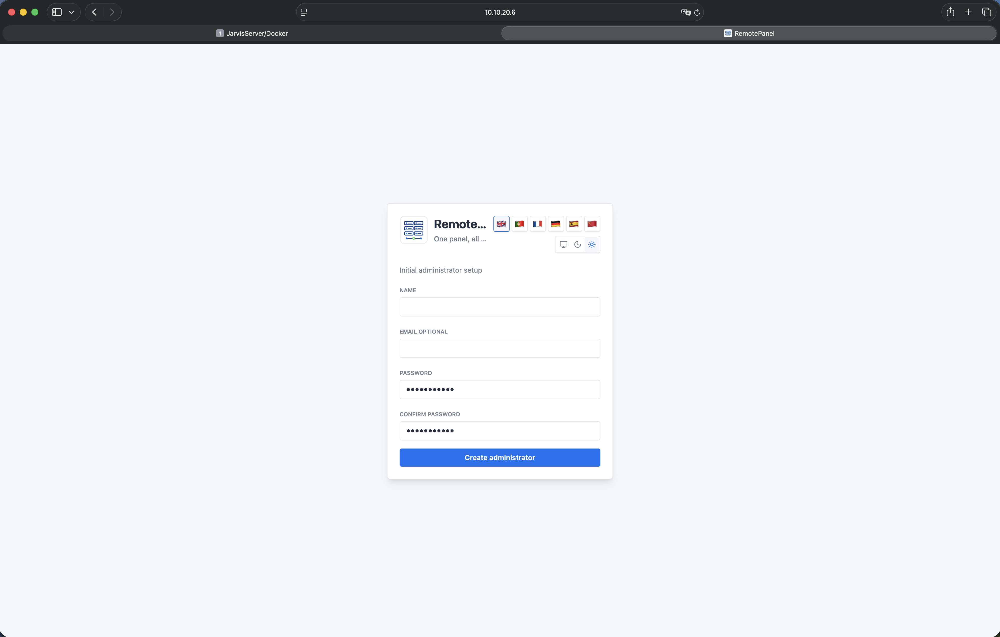

<p align="center">
  
</p>

RemotePanel is an open-source, self-hosted homelab control panel for managing remote machines, SSH/SFTP access, SMB shares, files, terminal sessions, stats, Wake-on-LAN, reboot, and shutdown actions from one clean web UI.

RemotePanel runs as one Docker app: the React frontend is built into the image and served by the FastAPI backend, with persistent data stored in `/data`.

## Screenshots

| Dashboard | Add Machine |
| --- | --- |
|  |  |

| Terminal | Files |
| --- | --- |
|  |  |

| Stats | Shares |
| --- | --- |
|  |  |

| Power Actions | First Setup |
| --- | --- |
|  |  |

| Login |
| --- |
|  |

## Features

- Docker deployment in one container
- FastAPI backend and React + Tailwind frontend
- SQLite database stored under `/data`
- Initial admin setup on first launch
- Login/logout with httpOnly cookies
- Argon2id password hashing
- Device credentials encrypted with `APP_SECRET_KEY`
- Machines with optional SSH/SFTP access
- Web SSH terminal
- File explorer for SFTP/SSH fallback and SMB shares
- Multi-select copy, move, delete, download, upload, and folder creation
- SMB shares grouped inside each machine
- Background transfer jobs with progress, speed, ETA, cancellation, and recent history
- Wake-on-LAN, reboot, and shutdown actions
- Stats panel with CPU, per-core CPU when available, memory, disk, and uptime
- Light, dark, and system theme modes
- English, Portuguese, French, German, Spanish, and Chinese UI

## Supported Targets

RemotePanel is designed for mixed homelabs:

- Linux and Home Assistant OS
- macOS
- FreeBSD
- Windows 10/11 and Windows Server with OpenSSH Server
- SMB shares on NAS/server targets

Stats, reboot, shutdown, terminal, and files require SSH/SFTP access on the target machine. Wake-on-LAN requires a saved MAC address and compatible hardware/network configuration.

## Important Security Note

Set `APP_SECRET_KEY` before production use and keep it stable.

RemotePanel encrypts saved machine credentials with this key. If you lose or change it, existing saved credentials cannot be decrypted.

Generate a key:

```bash
openssl rand -base64 48
```

## Linux Installation

These steps work on a typical Ubuntu/Debian server. Other Linux distributions are similar as long as Docker is installed.

### 1. Install Docker

```bash
sudo apt update
sudo apt install -y ca-certificates curl gnupg git openssl
sudo install -m 0755 -d /etc/apt/keyrings
curl -fsSL https://download.docker.com/linux/ubuntu/gpg | sudo gpg --dearmor -o /etc/apt/keyrings/docker.gpg
sudo chmod a+r /etc/apt/keyrings/docker.gpg
echo \
  "deb [arch=$(dpkg --print-architecture) signed-by=/etc/apt/keyrings/docker.gpg] https://download.docker.com/linux/ubuntu \
  $(. /etc/os-release && echo "$VERSION_CODENAME") stable" | \
  sudo tee /etc/apt/sources.list.d/docker.list > /dev/null
sudo apt update
sudo apt install -y docker-ce docker-ce-cli containerd.io docker-buildx-plugin docker-compose-plugin
```

Confirm Docker is working:

```bash
sudo docker version
sudo docker compose version
```

### 2. Clone RemotePanel

```bash
cd /opt
sudo git clone https://github.com/soundflow-dev/remotepanel.git remotepanel
cd remotepanel
```

### 3. Create `.env`

```bash
sudo cp .env.example .env
sudo nano .env
```

Example:

```env
APP_PORT=8080
COOKIE_SECURE=false
APP_SECRET_KEY=replace-this-with-openssl-rand-base64-48
```

Generate a secret if needed:

```bash
openssl rand -base64 48
```

### 4. Start RemotePanel

```bash
sudo docker compose up -d --build
```

Open:

```text
http://SERVER_IP:8080
```

On first launch, create the admin user.

### 5. Update RemotePanel Later

```bash
cd /opt/remotepanel
sudo git pull
sudo docker compose up -d --build
```

## Unraid Installation

These steps use the Unraid terminal and work even if your Unraid installation does not have `docker compose`.

### 1. Open Unraid Terminal

Use the Unraid web terminal or SSH into your server.

### 2. Clone RemotePanel

```bash
cd /mnt/user/appdata
git clone https://github.com/soundflow-dev/remotepanel.git
cd remotepanel
```

### 3. Create `.env`

Generate a secret:

```bash
openssl rand -base64 48
```

Create the file:

```bash
nano .env
```

Paste this, replacing the secret:

```env
APP_PORT=8090
COOKIE_SECURE=false
APP_SECRET_KEY=replace-this-with-your-generated-secret
```

Save in nano:

```text
CTRL + O
Enter
CTRL + X
```

### 4. Build the Docker Image

```bash
docker build -t remotepanel .
```

### 5. Start the Container

```bash
docker run -d \
  --name remotepanel \
  --restart unless-stopped \
  --label net.unraid.docker.icon="https://raw.githubusercontent.com/soundflow-dev/remotepanel/main/frontend/public/brand/icon-512.png" \
  --label net.unraid.docker.webui="http://[IP]:[PORT:8000]" \
  -p 8090:8000 \
  -v /mnt/user/appdata/remotepanel/data:/data \
  --env-file .env \
  remotepanel
```

Open:

```text
http://UNRAID_IP:8090
```

The Unraid labels in the `docker run` command make the RemotePanel icon and WebUI shortcut appear correctly in the Unraid Docker page.

On first launch, create the admin user.

### 6. Update RemotePanel Later

```bash
cd /mnt/user/appdata/remotepanel
git pull
docker build -t remotepanel .
docker rm -f remotepanel
docker run -d \
  --name remotepanel \
  --restart unless-stopped \
  --label net.unraid.docker.icon="https://raw.githubusercontent.com/soundflow-dev/remotepanel/main/frontend/public/brand/icon-512.png" \
  --label net.unraid.docker.webui="http://[IP]:[PORT:8000]" \
  -p 8090:8000 \
  -v /mnt/user/appdata/remotepanel/data:/data \
  --env-file .env \
  remotepanel
```

### 7. View Logs

```bash
docker logs -f remotepanel
```

### 8. Clean Install on Unraid

Warning: this removes all RemotePanel data.

```bash
docker rm -f remotepanel
docker rmi -f remotepanel
rm -rf /mnt/user/appdata/remotepanel
```

Then repeat the Unraid installation steps above.

## Backups

Back up both:

- `/mnt/user/appdata/remotepanel/data`
- `/mnt/user/appdata/remotepanel/.env`

The `.env` file contains `APP_SECRET_KEY`, which is required to decrypt saved machine credentials after restoring.

Example Unraid backup:

```bash
mkdir -p /mnt/user/backups
tar -czf /mnt/user/backups/remotepanel-data-backup.tar.gz \
  -C /mnt/user/appdata/remotepanel data .env
```

## Adding Machines

For SSH/SFTP features, the target machine must have SSH enabled.

Common target setup:

- Linux/FreeBSD: install and enable OpenSSH server.
- macOS: enable **System Settings > General > Sharing > Remote Login**.
- Windows: enable OpenSSH Server and use a local/admin account for power actions and stats.
- Home Assistant OS: SSH access works for terminal/stats/files where permissions allow it.

Use the machine's IP/hostname, SSH port, username, and password or SSH key. Add a MAC address only if you want Wake-on-LAN.

## Adding SMB Shares

SMB shares are added inside a machine through **Shares**.

Use full paths such as:

```text
smb://10.10.20.8/Media
\\10.10.20.8\Media
```

If a machine has multiple shares, add each share under the same machine.

## Transfer Settings

Optional `.env` settings:

```env
TRANSFER_CHUNK_SIZE=16777216
TRANSFER_PREFETCH_CHUNKS=2
TRANSFER_PARALLEL_FILES=1
TRANSFER_FILE_STREAMS=3
TRANSFER_FILE_STREAM_MIN_SIZE=1073741824
SMB_REQUIRE_SIGNING=true
SMB_AUTH_PROTOCOL=negotiate
```

The defaults are tuned to keep memory usage reasonable during very large transfers. On systems with plenty of RAM, increasing `TRANSFER_FILE_STREAMS` or `TRANSFER_PARALLEL_FILES` can improve throughput at the cost of higher memory usage.

For trusted homelab networks, `SMB_REQUIRE_SIGNING=false` may improve SMB speed if your NAS allows unsigned SMB.

## Development

Backend:

```bash
cd backend
python -m venv .venv
source .venv/bin/activate
pip install -r requirements.txt
APP_SECRET_KEY=dev-secret DATA_DIR=./data uvicorn app.main:app --reload
```

Frontend:

```bash
cd frontend
npm install
npm run dev
```

Set `VITE_API_BASE=http://localhost:8000/api` when running frontend and backend on separate dev ports.

## License

MIT
